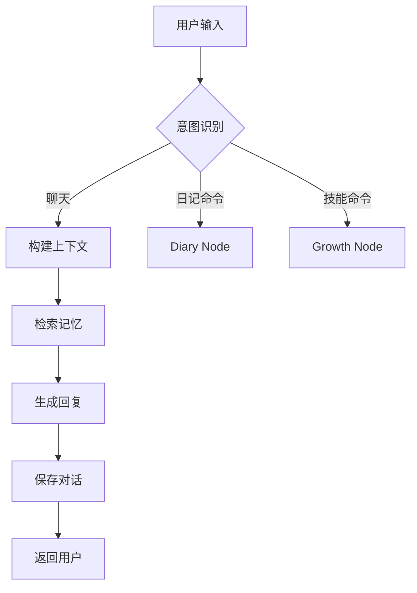
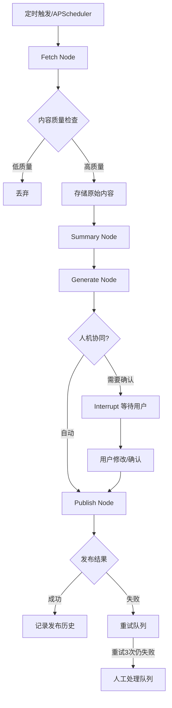
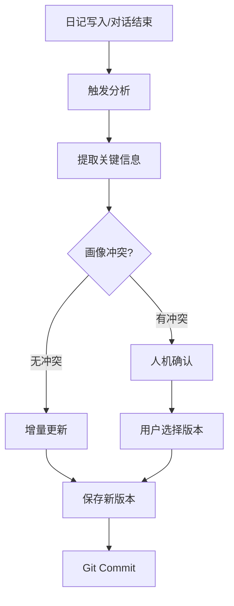

# Huaqi Code Agent - 产品需求文档 (PRD)

## 1. 文档信息

| 项目 | 内容 |
|------|------|
| 版本 | v1.0 |
| 日期 | 2025-03-27 |
| 状态 | Draft |

---

## 2. 产品概述

### 2.1 产品定位

**Huaqi (花旗)** 是一个个人 AI 伴侣系统，定位为"养育 AI"而非"使用 AI"。系统通过持续记录用户的日记、对话、技能成长数据，构建深度个性化的 AI 伴侣，实现长期陪伴、成长辅助、内容创作三大核心价值。

### 2.2 核心愿景

> "不是使用 AI，而是养育 AI"

AI 伴侣会随着与用户的长期交互而进化，逐渐理解用户的思维模式、情感状态、目标追求，成为真正的数字伙伴。

### 2.3 目标用户

- 追求长期自我成长的个人
- 内容创作者（博主、作家）
- 需要情感陪伴的独居人群
- 希望系统化记录人生的用户

---

## 3. 功能需求

### 3.1 当前核心功能（MVP）

| 模块 | 功能 | 优先级 |
|------|------|--------|
| **对话系统** | 自然语言交互，支持多行输入 | P0 |
| **日记系统** | 写作、浏览、语义搜索、批量导入 | P0 |
| **成长追踪** | 技能记录、目标管理、时间投入统计 | P0 |
| **人格引擎** | 可定制 AI 性格、语气、价值观 | P0 |
| **记忆系统** | 对话历史自动保存、检索 | P0 |
| **Git 同步** | 数据版本控制、多设备同步 | P0 |

### 3.2 架构改造目标（P0）

| 功能 | 说明 | 验收标准 |
|------|------|---------|
| **LangGraph 迁移** | 从 CLI 脚本迁移到 Agent 架构 | 核心流程基于 LangGraph StateGraph |
| **APScheduler 定时任务** | 支持晨间问候、日报生成等定时触发 | 可配置 cron 表达式，持久化任务 |
| **Chroma 向量检索** | 引入 Embedding 支持语义搜索 | BM25 + 向量混合检索 |
| **内容流水线** | 论坛监控 → 总结 → 生成 → 发布 | 支持 X、RSS 源，可扩展新平台 |
| **人机协同** | 关键节点支持人工确认/修改 | LangGraph interrupt 机制 |

### 3.3 未来功能（P1-P3）

#### P1 - 记忆增强
- [ ] 语音日记（Whisper 转录）
- [ ] 图片剪藏（OCR 提取 + 自动描述）
- [ ] 网页剪藏（Readability + 内容提取）
- [ ] 自动标签关联（双向链接）
- [ ] 记忆漫游（去年今日、随机回顾）

#### P2 - 内容创作矩阵
- [ ] 多平台适配（微博、即刻、知乎、公众号）
- [ ] 内容日历（可视化选题规划）
- [ ] 热点追踪（指定领域 RSS + AI 筛选）
- [ ] 风格迁移（一键改写多平台风格）

#### P3 - 智能助理
- [ ] 邮件/消息草稿生成
- [ ] 会议纪要提取（TODO + 决策点）
- [ ] 待办智能提醒（结合日记上下文）
- [ ] 决策辅助（调取历史经验）

#### P4 - 数据分析与洞察
- [ ] 情绪仪表盘（周/月/年可视化）
- [ ] 时间投入分析（技能练习统计）
- [ ] 词云与趋势（关注领域变化）
- [ ] 年度回顾自动生成

#### P5 - 交互扩展
- [ ] Web 界面（脱离 CLI）
- [ ] 移动端（PWA/App）
- [ ] 语音实时对话
- [ ] AI 角色扮演（面试练习等）

---

## 4. 架构设计

### 4.1 系统架构图

```
┌─────────────────────────────────────────────────────────────────────┐
│                        用户交互层 (Presentation)                      │
├─────────────────────────────────────────────────────────────────────┤
│  ┌──────────────┐  ┌──────────────┐  ┌──────────────┐              │
│  │ CLI 交互模式  │  │ Web 界面(P4) │  │ API 接口(P4) │              │
│  └──────┬───────┘  └──────┬───────┘  └──────┬───────┘              │
└─────────┼────────────────┼────────────────┼────────────────────────┘
          │                │                │
          └────────────────┴────────────────┘
                           │
┌──────────────────────────▼──────────────────────────────────────────┐
│                      应用服务层 (Application)                        │
├─────────────────────────────────────────────────────────────────────┤
│  ┌────────────────────────────────────────────────────────────┐    │
│  │                    huaqi-daemon                             │    │
│  │  ┌──────────────┐  ┌──────────────┐  ┌──────────────┐      │    │
│  │  │ APScheduler  │  │ Task Queue   │  │ LangGraph    │      │    │
│  │  │ (定时任务)    │  │ (内存队列)    │  │ (Agent 引擎) │      │    │
│  │  └──────┬───────┘  └──────┬───────┘  └──────┬───────┘      │    │
│  │         │                 │                 │               │    │
│  │         └─────────────────┴─────────────────┘               │    │
│  │                           │                                 │    │
│  │              ┌────────────▼────────────┐                    │    │
│  │              │    Agent Graph          │                    │    │
│  │              │  ┌─────────────────┐    │                    │    │
│  │              │  │ chat_node       │    │                    │    │
│  │              │  │ diary_node      │    │                    │    │
│  │              │  │ content_node    │    │                    │    │
│  │              │  │ insight_node    │    │                    │    │
│  │              │  └─────────────────┘    │                    │    │
│  │              └─────────────────────────┘                    │    │
│  └────────────────────────────────────────────────────────────┘    │
└─────────────────────────────────────────────────────────────────────┘
                           │
┌──────────────────────────▼──────────────────────────────────────────┐
│                       领域层 (Domain)                               │
├─────────────────────────────────────────────────────────────────────┤
│  ┌──────────────┐  ┌──────────────┐  ┌──────────────┐  ┌────────┐ │
│  │ 人格引擎     │  │ 成长追踪     │  │ 日记系统     │  │ 记忆   │ │
│  │ Personality  │  │ Growth       │  │ Diary        │  │ Memory │ │
│  └──────────────┘  └──────────────┘  └──────────────┘  └────────┘ │
│                                                                    │
│  ┌──────────────┐  ┌──────────────┐  ┌──────────────┐             │
│  │ 内容流水线   │  │ LLM 抽象层   │  │ 工具集       │             │
│  │ Pipeline     │  │ LLM Adapter  │  │ Tools        │             │
│  └──────────────┘  └──────────────┘  └──────────────┘             │
└─────────────────────────────────────────────────────────────────────┘
                           │
┌──────────────────────────▼──────────────────────────────────────────┐
│                     基础设施层 (Infrastructure)                      │
├─────────────────────────────────────────────────────────────────────┤
│  ┌──────────────┐  ┌──────────────┐  ┌──────────────┐  ┌────────┐ │
│  │ Markdown     │  │ Chroma       │  │ Git 同步     │  │ 配置   │ │
│  │ Store        │  │ Vector DB    │  │ Auto Commit  │  │ Config │ │
│  └──────────────┘  └──────────────┘  └──────────────┘  └────────┘ │
└─────────────────────────────────────────────────────────────────────┘
```

### 4.2 模块职责

| 模块 | 职责 | 未来扩展 |
|------|------|---------|
| **CLI** | 交互式命令行入口 | 将来可扩展 Web 界面 |
| **Daemon** | 常驻服务，承载定时任务 | 可扩展为分布式服务 |
| **Agent Graph** | LangGraph 状态机，编排核心流程 | 新增 workflow 类型 |
| **Personality** | 用户画像存储与更新 | 支持多维度分析 |
| **Growth** | 技能、目标、习惯追踪 | 学习路径规划 |
| **Diary** | 日记 CRUD、标签、搜索 | 多媒体日记 |
| **Memory** | 向量存储、语义检索 | 分层记忆系统 |
| **Pipeline** | 内容获取→处理→发布 | 新增平台适配器 |
| **Tools** | 外部工具集成 | MCP 生态扩展 |

---

## 5. 核心流程设计

### 5.1 对话流程（Chat Workflow）



**关键节点说明**：
- **意图识别**：轻量级分类（本地 mini 模型或规则）
- **上下文构建**：人格 + 近期日记 + 相关记忆
- **记忆检索**：混合搜索（BM25 + 向量）Top-5

### 5.2 内容流水线（Content Pipeline）



**Interrupt 节点设计**：
- 生成文案后自动暂停
- 推送通知（系统通知/邮件）
- **对话恢复机制**：用户直接在 CLI 聊天中输入 `resume <task_id>` 或 `确认任务` 即可恢复
- CLI 自动检测待处理中断任务并提示用户
- 恢复时 Agent 读取之前的状态继续执行

**恢复流程**：
```
用户输入: "resume task_001"
→ 系统查询 task_001 状态
→ 展示待确认内容
→ 用户: "确认发布" / "修改: xxx" / "取消"
→ Agent 根据决策继续执行
```

### 5.3 画像更新流程（Personality Update）



---

## 6. 扩展接口设计

### 6.1 平台适配器接口（Platform Adapter）

```python
# huaqi/pipeline/platforms/base.py
from abc import ABC, abstractmethod
from dataclasses import dataclass
from typing import Optional

@dataclass
class PlatformContent:
    """标准化内容格式"""
    title: Optional[str]
    body: str
    images: list[str]  # 图片路径
    tags: list[str]
    source_url: Optional[str]

@dataclass  
class PublishResult:
    success: bool
    platform_post_id: Optional[str]
    error_message: Optional[str]
    published_at: Optional[datetime]

class BasePlatformAdapter(ABC):
    """平台适配器基类 - 支持小红书、微博、即刻等"""
    
    @property
    @abstractmethod
    def platform_name(self) -> str: ...
    
    @abstractmethod
    async def authenticate(self, credentials: dict) -> bool:
        """验证并存储平台凭证"""
        ...
    
    @abstractmethod
    async def publish(self, content: PlatformContent) -> PublishResult:
        """发布内容到平台"""
        ...
    
    @abstractmethod
    async def get_status(self, post_id: str) -> dict:
        """获取发布状态（阅读量、点赞等）"""
        ...
    
    # 可选扩展
    async def schedule_publish(self, content: PlatformContent, publish_at: datetime) -> str:
        """定时发布，返回任务ID"""
        raise NotImplementedError
    
    async def delete_post(self, post_id: str) -> bool:
        """删除已发布内容"""
        raise NotImplementedError
```

**小红书适配器实现思路**：
```python
class XiaohongshuAdapter(BasePlatformAdapter):
    """
    方案 B: 半自动发布
    - 生成内容 → 展示二维码 → 用户扫码 → 预填充内容
    """
    platform_name = "xiaohongshu"
    
    async def publish(self, content: PlatformContent) -> PublishResult:
        # 1. 生成临时页面（本地 web server）
        page_url = await self._create_temp_page(content)
        # 2. 生成二维码
        qr_code = generate_qr(page_url)
        # 3. 推送通知给用户
        await self._notify_user(f"请扫描二维码确认发布: {qr_code}")
        # 4. 等待用户确认（通过 webhook 或轮询）
        confirmed = await self._wait_confirmation(timeout=3600)
        # 5. 预填充发布（通过小红书网页版模拟或分享 API）
        ...
```

### 6.2 数据源适配器接口（Data Source Adapter）

```python
# huaqi/pipeline/sources/base.py

@dataclass
class RawContent:
    """原始内容格式"""
    source: str  # "twitter", "rss", "hackernews"...
    source_id: str
    url: str
    title: str
    content: str
    author: Optional[str]
    published_at: datetime
    media_urls: list[str]  # 图片/视频链接
    metadata: dict  # 平台特有数据

class BaseDataSourceAdapter(ABC):
    """数据源适配器 - 支持 X、RSS、HackerNews 等"""
    
    @property
    @abstractmethod
    def source_name(self) -> str: ...
    
    @abstractmethod
    async def fetch_latest(self, query: str, since: datetime, limit: int = 10) -> list[RawContent]:
        """获取最新内容"""
        ...
    
    @abstractmethod
    async def fetch_by_id(self, content_id: str) -> Optional[RawContent]:
        """根据ID获取特定内容"""
        ...
    
    # 可选：实时推送（WebSocket/webhook）
    async def subscribe(self, query: str, callback: Callable):
        """订阅实时更新"""
        raise NotImplementedError
```

### 6.3 记忆处理器接口（Memory Processor）

```python
# huaqi/memory/processors/base.py

class BaseMemoryProcessor(ABC):
    """
    记忆处理器 - 支持不同类型的记忆处理
    用于：语音转文字、图片 OCR、网页提取等
    """
    
    @property
    @abstractmethod
    def processor_type(self) -> str: ...
    
    @abstractmethod
    async def process(self, raw_data: bytes, metadata: dict) -> ProcessedMemory:
        """
        处理原始数据，返回结构化记忆
        """
        ...
    
    @abstractmethod
    def supports(self, mime_type: str) -> bool:
        """检查是否支持该文件类型"""
        ...

@dataclass
class ProcessedMemory:
    content_type: str  # "text", "image_description", "audio_transcript"
    content: str
    summary: Optional[str]
    tags: list[str]
    embeddings: Optional[list[float]]  # 预计算的向量
    metadata: dict
```

**扩展实现示例**：
```python
# 语音处理器（P1 扩展）
class AudioMemoryProcessor(BaseMemoryProcessor):
    processor_type = "audio"
    
    async def process(self, raw_data: bytes, metadata: dict) -> ProcessedMemory:
        # 调用 Whisper API 或本地模型
        transcript = await self.whisper.transcribe(raw_data)
        summary = await self.llm.summarize(transcript)
        return ProcessedMemory(...)

# 图片处理器（P1 扩展）
class ImageMemoryProcessor(BaseMemoryProcessor):
    processor_type = "image"
    
    async def process(self, raw_data: bytes, metadata: dict) -> ProcessedMemory:
        # OCR + 视觉描述
        ocr_text = await self.ocr.extract(raw_data)
        description = await self.vision_model.describe(raw_data)
        return ProcessedMemory(...)
```

### 6.4 LLM  Provider 接口

```python
# huaqi/llm/base.py

class BaseLLMProvider(ABC):
    """LLM 提供者抽象 - 支持任意远端/本地模型"""
    
    @property
    @abstractmethod
    def provider_name(self) -> str: ...
    
    @abstractmethod
    async def chat(self, messages: list[Message], **kwargs) -> LLMResponse:
        ...
    
    @abstractmethod
    async def chat_stream(self, messages: list[Message], **kwargs) -> AsyncIterator[str]:
        ...
    
    # 可选：工具调用支持
    async def chat_with_tools(self, messages: list[Message], tools: list[Tool], **kwargs) -> LLMResponse:
        raise NotImplementedError
    
    # 可选：Embedding 支持
    async def embed(self, texts: list[str]) -> list[list[float]]:
        raise NotImplementedError
```

---

## 7. 非功能需求

### 7.1 性能要求

| 指标 | 目标值 | 备注 |
|------|--------|------|
| 对话响应延迟 | < 2s (首 token < 500ms) | 不含 LLM 推理时间 |
| 记忆检索速度 | < 100ms | 万级文档 |
| 日记保存速度 | < 50ms | 含向量计算 |
| 定时任务延迟 | < 1min | 相对设定时间 |
| 系统启动时间 | < 3s | CLI 冷启动 |

### 7.2 可靠性要求

| 场景 | 要求 |
|------|------|
| 数据持久化 | 写操作必须落盘，支持 Git 版本回溯 |
| 任务失败 | 重试 3 次，失败进死信队列 |
| 服务重启 | 定时任务状态恢复，未完成任务重新调度 |
| 人机协同中断 | 中断状态持久化，支持任意时刻恢复 |

### 7.3 可扩展性要求

| 需求 | 说明 |
|------|------|
| **配置热重载** | Daemon 支持配置修改后自动生效，无需重启服务 |
| **多用户预留** | 数据模型包含 user_id，支持未来多用户架构 |
| **Embedding 可迁移** | 支持切换 embedding 模型和向量数据库，原始文本永久保留 |
| **存储层抽象** | 向量存储支持 Chroma/Milvus/Pinecone 切换 |

### 7.3 安全要求

| 场景 | 要求 |
|------|------|
| API Key | 存储在 keyring 或加密文件 |
| 日记内容 | 本地存储，不上传云端（除非用户配置） |
| 第三方平台凭证 | OAuth 优先，密码加密存储 |
| 命令注入 | 用户输入严格校验，工具参数白名单 |

### 7.4 可观测性

| 类型 | 实现 |
|------|------|
| 日志 | 结构化日志（JSON），分级存储 |
| 指标 | 对话数、任务成功率、API 调用量 |
| 追踪 | LangSmith / Langfuse 集成 |
| 调试 | 本地 trace 文件，支持重放 |

---

## 8. 数据结构

### 8.1 配置结构

```yaml
# config.yaml
app:
  name: "huaqi"
  version: "2.0.0"
  data_dir: "~/.huaqi"

llm:
  default_provider: "kimi"
  providers:
    kimi:
      base_url: "https://api.moonshot.cn/v1"
      api_key: "${KIMI_API_KEY}"
      default_model: "kimi-k2.5"
      embedding_model: null  # 使用独立 embedding 服务
    
    openai:
      base_url: "https://api.openai.com/v1"
      api_key: "${OPENAI_API_KEY}"
      default_model: "gpt-4o"

embedding:
  provider: "local"  # local / openai
  local_model: "BAAI/bge-small-zh"
  device: "auto"  # auto / cpu / cuda

memory:
  vector_store: "chroma"
  chroma_path: "~/.huaqi/memory/vectors"
  hybrid_search_alpha: 0.7  # 向量权重

scheduler:
  enabled: true
  timezone: "Asia/Shanghai"
  jobs:
    - id: "morning_greeting"
      cron: "0 8 * * *"
      task: "generate_morning_greeting"
    - id: "daily_summary"
      cron: "0 22 * * *"
      task: "generate_daily_summary"

pipeline:
  sources:
    - name: "twitter_tech"
      adapter: "twitter"
      query: "AI OR LLM OR programming"
      fetch_interval: 3600  # 秒
    - name: "hackernews"
      adapter: "hackernews"
      min_score: 100
  
  publish:
    xiaohongshu:
      adapter: "xiaohongshu"
      auto_publish: false  # 必须人工确认
      notify_method: "system"  # system / email / webhook

personality:
  auto_update: true
  update_interval_days: 7
  confirmation_threshold: "medium"  # always / medium / never
```

### 8.2 日记结构

```markdown
---
date: 2025-03-27
time: 21:30
mood: calm
tags: [反思, 工作]
location: 北京
weather: 晴
embedding_id: vec_abc123
---

# 日记标题

今日工作内容...

## 思考

关于项目的反思...
```

### 8.3 任务状态结构

```json
{
  "task_id": "task_20250327_001",
  "task_type": "content_pipeline",
  "status": "waiting_confirmation",
  "created_at": "2025-03-27T08:00:00Z",
  "updated_at": "2025-03-27T08:05:00Z",
  "graph_state": {
    "source_content": {...},
    "generated_content": {
      "xiaohongshu": "文案内容...",
      "weibo": "短文案..."
    },
    "interrupt_node": "human_review",
    "interrupt_data": {
      "qr_code": "data:image/png;base64,...",
      "preview_url": "http://localhost:8080/preview/task_001"
    }
  },
  "retry_count": 0,
  "max_retries": 3
}
```

---

## 9. 风险评估

| 风险 | 概率 | 影响 | 缓解措施 |
|------|------|------|---------|
| 小红书发布方案失败 | 中 | 高 | 保留手动发布 fallback，预留正式 API 支持 |
| 向量检索性能不足 | 低 | 中 | Chroma 支持百万级，可迁移到 Milvus/Pinecone |
| 定时任务持久化丢失 | 低 | 中 | APScheduler SQLAlchemyJobStore 持久化 |
| LangGraph 学习曲线 | 中 | 中 | 先实现简单 workflow，逐步复杂化 |
| 第三方数据源不稳定 | 高 | 低 | 多源备份，本地缓存 |

---

## 10. 验收标准

### 10.1 功能验收

- [ ] CLI 与 Daemon 可独立运行，共享数据
- [ ] 支持定时生成晨间问候、日报
- [ ] 支持配置 X/RSS 源监控，自动总结生成文案
- [ ] 小红书发布需要人工确认（二维码/链接）
- [ ] 日记语义搜索准确率达 80%+
- [ ] 画像自动更新，重大变化需人工确认
- [ ] 服务重启后任务状态可恢复

### 10.2 性能验收

- [ ] 对话响应 < 2s（不含 LLM）
- [ ] 记忆检索 < 100ms
- [ ] 10MB 日记数据不丢性能

### 10.3 代码验收

- [ ] 所有接口预留扩展点
- [ ] 单元测试覆盖率 > 60%
- [ ] 集成测试覆盖核心 workflow
- [ ] 文档完整（API、部署、扩展）

---

## 附录

### A. 术语表

| 术语 | 解释 |
|------|------|
| LangGraph | LangChain 团队开发的 Agent 工作流编排框架 |
| APScheduler | Python 定时任务调度库 |
| Chroma | 开源向量数据库 |
| MCP | Model Context Protocol，模型上下文协议 |
| Interrupt | LangGraph 的人机协同机制，暂停等待用户输入 |
| Checkpoint | LangGraph 的状态持久化机制 |

### B. 参考链接

- [LangGraph Documentation](https://langchain-ai.github.io/langgraph/)
- [APScheduler Documentation](https://apscheduler.readthedocs.io/)
- [Chroma Documentation](https://docs.trychroma.com/)
